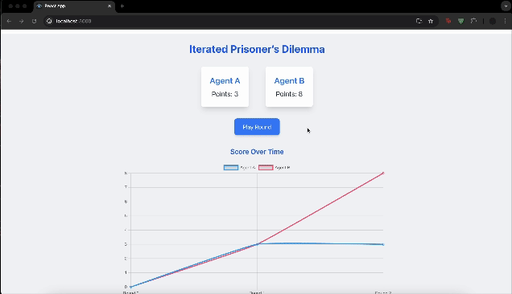

# LLMGameTheory



Welcome to the `LLMGameTheory` repository! This project simulates the Iterated Prisoner’s Dilemma using Large Language Model (LLM) agents that store and utilize interaction history to inform strategic decisions, exploring the dynamics of cooperation and competition.

## Table of Contents

- [Introduction](#introduction)
- [Features](#features)
- [Getting Started](#getting-started)
  - [Prerequisites](#prerequisites)
  - [Installation](#installation)
  - [Running the Application](#running-the-application)
- [Usage](#usage)
- [Contributing](#contributing)
- [License](#license)
- [Contact](#contact)

## Introduction

The Iterated Prisoner's Dilemma is a popular game theory problem that explores the conflict between individual rationality and collective cooperation. In this project, we simulate an iterated version of the Prisoner's Dilemma using agents powered by Large Language Models (LLMs). These agents store interaction history and use it to inform their strategic decisions over multiple iterations.

## Features

- Simulates the Iterated Prisoner's Dilemma using LLM-based agents.
- Agents utilize interaction history to make informed strategic decisions.
- Dashboard and visualization tools to observe the dynamics of cooperation and competition.
- Customizable parameters for experiments and simulations.

## Getting Started

Follow these instructions to set up and run the project on your local machine.

### Prerequisites

You will need the following software installed on your machine:

- Python 3.8+
- Node.js
- npm (Node Package Manager)

### Installation

1. **Clone the repository**
   ```sh
   git clone https://github.com/FaizanFaisal25/LLMGameTheory.git
   cd LLMGameTheory
   ```

2. **Install Python dependencies**
   ```sh
   cd server
   pip install -r requirements.txt
   ```

3. **Set up environment variables**

   Create a `.env` file in the `server` folder and add your API keys:
   ```sh
   OPENAI_API_KEY=your_openai_api_key
   TAVILY_API_KEY=your_tavily_api_key
   ```

4. **Install Node.js dependencies**
   ```sh
   cd ../client
   npm install
   ```

### Running the Application

1. **Start the server**

   Navigate to the `server` folder and run the Flask server:
   ```sh
   cd ../server
   python server.py
   ```

2. **Start the frontend**

   In a new terminal window, navigate to the `client` folder and start the frontend:
   ```sh
   cd ../client
   npm start
   ```

   The application should now be running, with the server handling backend logic and the frontend displaying the user interface.

## Usage

Once the application is running, you can access it via your web browser. The frontend provides tools and visualizations to track the interactions between agents and observe the outcomes of different strategies in the Iterated Prisoner's Dilemma.

## Contributing

Contributions are welcome! If you wish to contribute to the project, please follow these steps:

1. Fork the repository.
2. Create a new branch (`git checkout -b feature/YourFeature`).
3. Commit your changes (`git commit -am 'Add Some Feature'`).
4. Push to the branch (`git push origin feature/YourFeature`).
5. Create a new pull request.

Please ensure that your code adheres to the project's coding standards and passes all tests.

## License

This project is licensed under the MIT License. See the `LICENSE` file for details.
